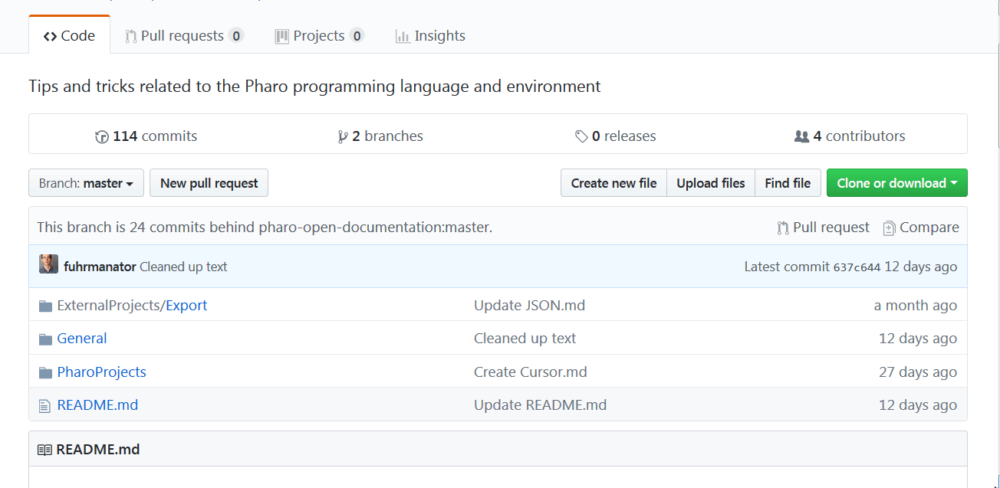

# Contribution guidlines

  * [Suggest new pages](#suggest-new-pages)
  * [Entries structure](#entries-structure)
  * [Edit a page](#edit-a-page)
  * [Add a new page](#add-a-new-page)
  * [Deleting, Moving or Renaming a page](#deleting-moving-or-renaming-a-page)
    + [If the content is obsolete](#if-the-content-is-obsolete)
    + [If we want to move a page](#if-we-want-to-move-a-page)
    + [If we want to split a page](#if-we-want-to-split-a-page)
    + [If we want to rename a page](#if-we-want-to-rename-a-page)

## Suggest new pages

To suggest pages that could fit the wiki, the recommanded may is to open an issue containing a summary of the page, the section in which it should be (General, Internal projects of Pharo or External projects of Pharo) and optionaly links to already existing documentation on the projects.

On the language and environment part of the wiki we accept to document a part of the system that is already documented outside the wiki at the condition that we reference in a *See also* section those documentation. The goal is to have a centralized information and to provide alternative ways of explaining.

If you wish to add the new entry yourself, see section [Add a new page](#add-a-new-page).

## Entries structure

The entries structure is free but we still have some conventions. 

* Documentation on external projects should mostly contains small example, comparaisons between multiple projects, links to official documentations and repositories. We can accept documentation on the external projects in case there is none by the official maintainer.
* Long entries should begin with a table of content. We recommand [https://ecotrust-canada.github.io/markdown-toc/](https://ecotrust-canada.github.io/markdown-toc/).
* References to external/decentralized documentation should be in a *See also* section at the end of the entry.
* Smalltalk snippets should be highlighted using this format:


<pre>```Smalltalk
  Code
```</pre>

## Edit a page

If you see some typo, wrong informations or missing informations you can report it in the issues or you can also edit the document yourself and create a pull request.

Creating a PR is as easy as clicking on the Edit (pen) button, updating the document and propose the changes.


## Add a new page

In order to add a page you can just go into the folder of the section where the page should be and use the "Create new file button".



If you need to integrate images in your entry, add them next to the Markdown file with an name following this pattern: `<NameOfThePage>_Image_<Description>.extension`. For example for an image illustrating `Iceberg` in a page called `VCS.md`, the image should be named `VCS_Image_IcebergIllustration.png`.

Once the page is created you need to add it to the [README.md](README.md) in the right section.

You can add a badge to indicate the progress of the page. 

The current badges we use are:
-  : ``  We use it to signal to the user that the page is not yet finished but it already contains useful informations.
-  : `` We use it to signal that the first version of the page is finished but need more review for the content or the quality of the english. 

An entry in the README can also have a one short sentense explaining the purpose of the page.

The pages focus mainly on the latest stable Pharo version. This does not mean we refuse contribution on older or development version of Pharo, but those should be complement of the current stable version.

## Deleting, Moving or Renaming a page

**/!\\ We never delete a page. /!\\**

This is a rule in this wiki. What is more annoying than a 404 when we look for documentation?

Instead we have different strategies depending on why we want to delete a page.

### If the content is obsolete

If the content is obsolete, we do not delete the page but we add a note (using `> OBSOLETE : bla`) at the beginning explaining why the guide is obsolete. The guide can be removed from the README. 

### If we want to move a page

If we want to move a page, we can copy it to the new location and let the old page at the original location with an explanation and a link to the new page.

### If we want to split a page

Sometimes a page is too big and would win to be splited. In that case the content can be extracted in multiple pages but the original page should stay and contains an index of the new pages.

### If we want to rename a page

If we want to rename a page, we can copy it with the new name and let the old page at the original location with an explanation and a link to the new page.
