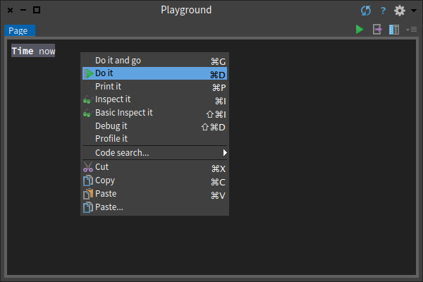

# Playground
Playground is a tool that is most often used for typing Pharo expressions and executing them but it can be used as a scratchpad area where fragments of Pharo code can be entered, stored, edited, and evaluated.

You can open it with the shortcut `cmd/ctrl + o + w` or using the menu entry from the menubar: 

## Basic usage
The Playground can be used to quickly execute Pharo code. You write something and then can do operations on the code, such as:

1. __Do it__ or using the shortcut `⌘D`: Execute the code/expression

* __Print it__ or using the shortcut `cmd/ctrl + p`: Compiles the expression, executes it, sends the message `printString` to the result, and displays the resulting string.

* __Do it and go__ `cmd/ctrl + g` :  Execute the code and additionally opens a navigable inspector on the side of the playground. It allows us to navigate the object structure.

* __Inspect it__ `cmd/ctrl + i` : Execute the code and additionally opens a navigable inspector outside of the playground. It allows us to navigate the object structure.

> The title tells us that `11:55:11.561177 am` is an instance of the class `Time`. The top panel allows us to browse the instance variables of an object and their values. The bottom panel can be used to write expressions to send messages to the object. 

* __Basic inspect it__ `cmd/ctrl + shift + i` : Opens a minimal inspector on the result of the expression. (Might be useful if you work on the Inspector for example)
* __Debug it__ `cmd/ctrl + shift + d` : Opens a debugger on the code with the context at the start of the snippet.

>The Debugger is a tool that not only lets you inspect the run-time stack of your program when an error is raised, but it also enables you to interact with all of the objects of your application, including the source code. In many cases you can modify your source code from the debugger and continue executing. The debugger is especially effective as a tool to support test-first development in tandem with SUnit.

* __Profile it__ : Profiles the code with the Pharo profile tool which shows how much time is spent for each message sent.
* __Code search__ offers several options provided by System Browser, such as browsing the source code of an expression, searching for senders and implementors, and so on.

You can also use the playground for typing any text that you would like to remember, such as to-do lists or instructions for anyone who will use your image.

## Some Advices
### Doing vs. Printing
The diference between this two actions is visual. try to execute something like `1+5` with `Do it`. Maybe you think that nothing happened because there isn't a visual cue about the execution but in fact something did happen. You sent the message `+` with argument `5` to the number `1`.

Now try to do it with Print it, the same will happen but also you will see the result printed just aside:

That could be useful if you want to understand the result value.

## Advance usage

>TODO
