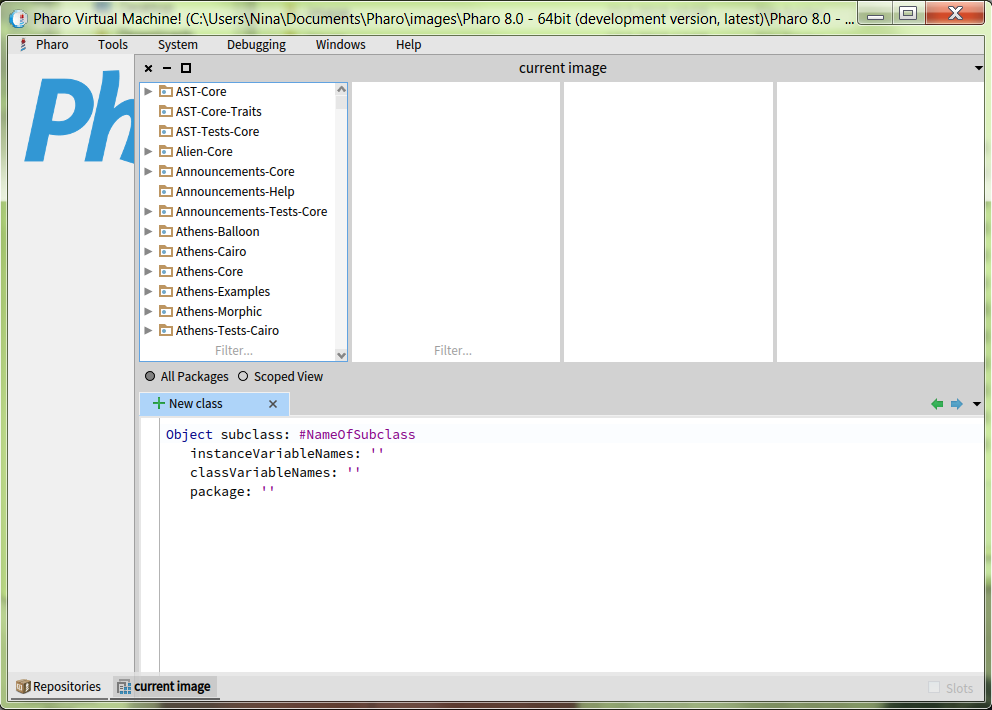
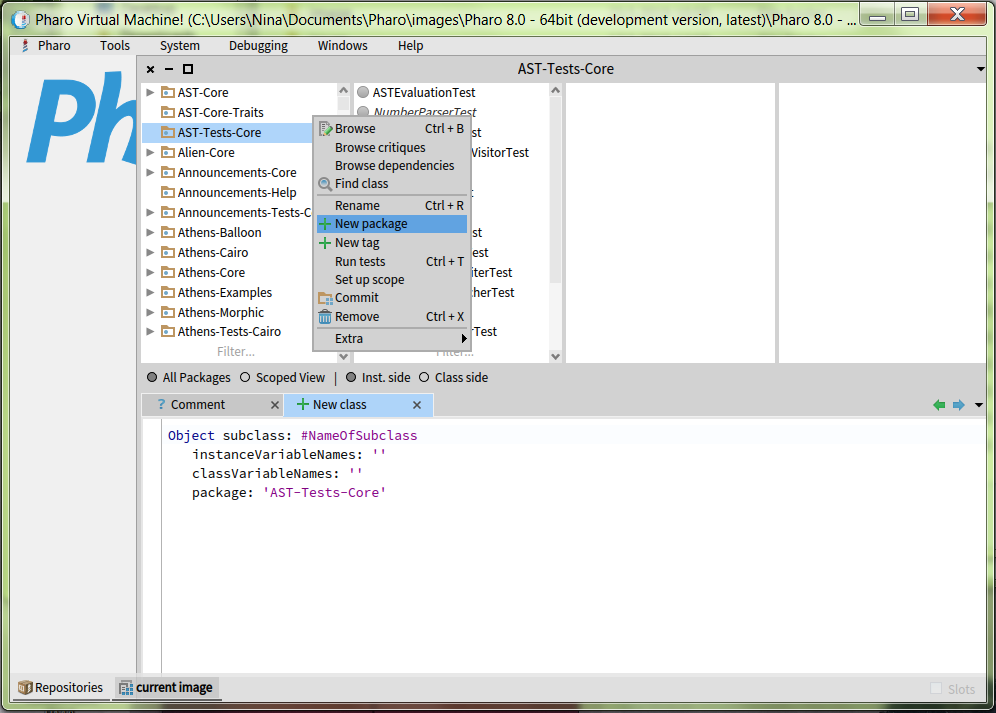
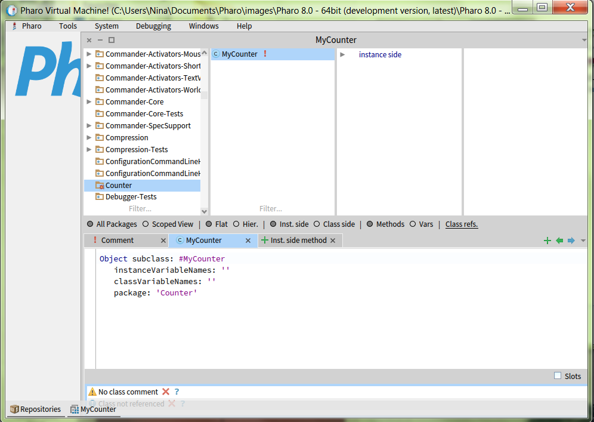
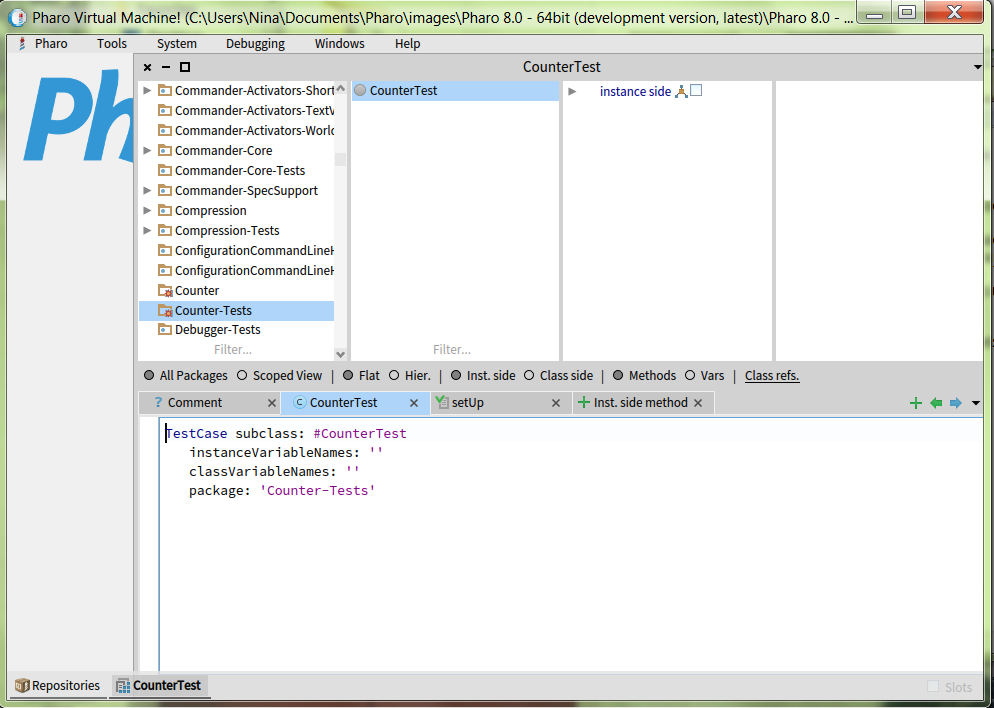
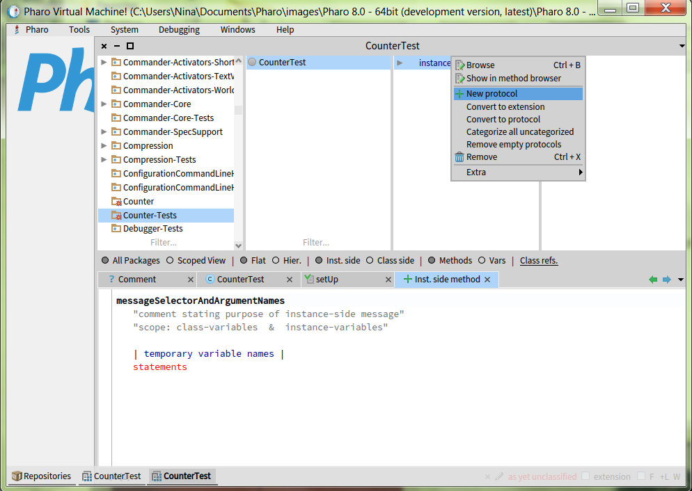

# Setting up a new project

In this article, we describe the good workflow for setting up a new project in Pharo. We will guide you through the whole process from getting a new Pharo image, creating the GitHub repository, and setting up the CI.

We will demonstrate everything by setting up a toy project - `Counter`, inspired by Chapter 14. Seaside by Example of [Pharo by Example](https://files.pharo.org/books-pdfs/updated-pharo-by-example/2017-01-14-UpdatedPharoByExample.pdf) book. It is a simple class that has a value which can be incremented or decremented.

## Step 0. Download and install Pharo Launcher

In order to work with Pharo, you should dowload and install Pharo Launcher - a tool for managing Pharo images. It is available for Windows, Linux, and macOS in both 32bit and 64bit version and can be dowloaded from [http://pharo.org/download]().


## Step 1. Get a fresh Pharo image

Instructions in this tutorial were written for Pharo 8, 64bit. But they should also work fine for Pharo 7. We suggest that you start your new project with the latest development version of Pharo.

Open your Pharo Launcher. You will see two panels:

- **New Image Templetes** on the left - here you can select a template of a new image that you want to create on your machine.
- **Current Images** on the right - created images will appear here. By double-clicking on image name, you can launch it.

Open the list of `Official distributions` in the left panel and double-click on the latest development version of Pharo. In our case, this is `Pharo 8.0 - 64bit (development version, latest)`. Give a nice descriptive name to your new image and press `OK`. You can now find your image in the right panel. Launch it by double-clicking on the image name.


## Step 2. Create a package and a class


Let us make our first package. In your newly made image in Pharo Launcher, look at the menu on the top. Choose a tools card and from there open System Browser.



System Browser is split into five parts. The most left one, shows all the packages that already exist. To create a new one, press the right click of a mouse on this part, and choose the option New Package. 



Choosing it, a new small window will open, where you give a name to the package you are creating.

We will show this by following an example. The task is to make a counter.Type the name *Counter* in Window for creating a new package and press ok.


To create a class, first you need to choose the package in which it will be located. Then look at the bottom part of the System Browser in it there is a template for creating a class. It gives us all the information we need: superclass, variables, package. Creating a new class is as easy as filling out this template. Continuing with our example, we will create a new class *MyCounter*. The superclass is *Object*, so we will not change that. But we will change the name of the class. You will notice that saving our class, the second left part of SystemBrowser is no longer empty.



## Step 3. Write some failing tests

If we want to follow the TDD (test driven development), we need to create tests first. All tests are stored in a test class, which is a subclass of *TestCase*. By useing the previous step, make Counter-Tests package and CounterTest class.



Next what we need to do is create some tests. We do this by clicking on out test class, choosing a protocol in second from the right part of the Browser, and implementing a test. 

In case there are no protocols to choose from (this happens in cases when we are making our first test), then we need to add a new one. This is done by pressing a right click on *instance side*, going to New protocol option and picking a protocol you need (in our case tests).



After we have choosen a protocol, our bottom part of System Browser will change and show a template for making methods (each test is a separate method). When giving a name it is important to put the word *test* first, so that Pharo knows that what we are making is in fact a test.

In our example, a counter will be incrementing and decrementing some value. You will notice that we are using methods which have not been created yet and that each test you write will fail (be red) when you run it. 

We can make these tests:
	1. Creating MyCounter object. 
	We want to check if the object we created is not equal to nil, that is why we are using *self deny:* message. This will to a check if the statement we send is true and if it is return false. 

	2. Incrementing value. 
	Here we want to check if the method *increment* is really doing his job and adding one to the value. What we did here is: created a new object MyCounter, set the test value, call the method *increment* and checked if the new value is equal to an expected result. Here we use *self assert:* key word message, which returns true if the statement is in fact true. 

	3  Decrementing value.Here we are checking if the method *decrement* is doing his job and subtracting one from the value. The process of creating this test is similar to previous one.

## Step 4. Add methods to make tests green

## Step 5. Create a baseline and a Metacello script

Baselines allow us to manage dependencies and specify how the repository should be loaded. We can use `Metacello` object to load the project that has a baseline defined for it. In this tutorial we will only show an example of creating a baseline for our simple `Counter` project. For more information on baselines, please read this excellent [Baselines](https://github.com/pharo-open-documentation/pharo-wiki/blob/master/General/Baselines.md) guide on Pharo Wiki.

Start by creating a package called `BaselineOf<YourProjectName>` and the class with the same name which is the subclass of `BaselineOf`. In our case, both package and class are called `BaselineOfCounter`.

```Smalltalk
BaselineOf subclass: #BaselineOfCounter
    instanceVariableNames: ''
    classVariableNames: ''
    package: 'BaselineOfCounter'
```

Now create a method `BaselineOfCounter >> baseline:` with the following content:

```Smalltalk
baseline: spec
    <baseline>
    spec for: #common do: [	
				
        "Packages"
        spec
            package: 'Counter';
            package: 'Counter-Tests' with: [ spec requires: #('Counter') ] ].
```

At this point, our baseline does not contain any external dependencies. It only says that our project consists of two packages: `Counter` and `Counter-Tests` and that the package `Counter-Tests` depends on `Counter`.

## Step 6. Create repository on GitHub

## Step 7. Load the repository into your image

## Step 8. Create an src/ folder and repair the repository

```Smalltalk
(FileLocator localDirectory / 'iceberg' / '<userName>' / '<projectName>' / 'src') ensureCreateDirectory 
```

## Step 9. Add packages and do the first commit

## Step 10. Set up the continuous integration (CI)

## Step 11. Add badges to your README.md
