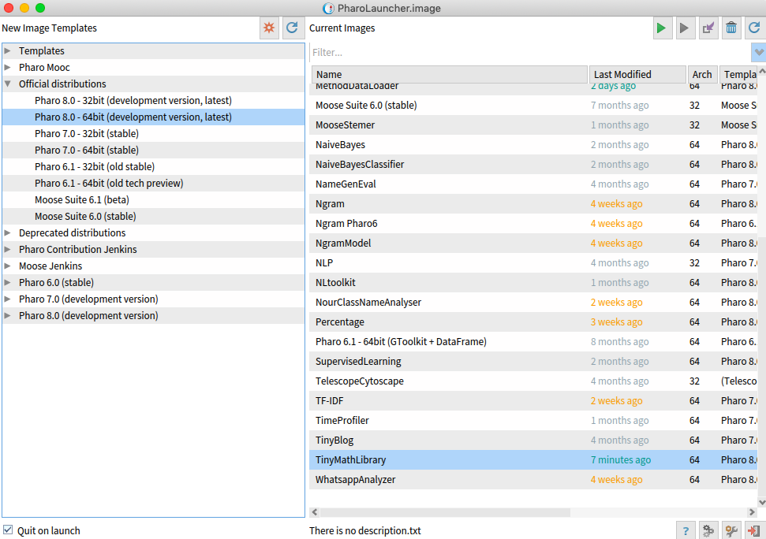

# Setting up a new project

In this article, we describe the good workflow for setting up a new project in Pharo. We will guide you through the whole process from getting a new Pharo image, creating the GitHub repository, and setting up the CI.

We will demonstrate everything by setting up a simple toy project - `TinyMathLibrary`. It is a simple package that implements for arithmetic operations:

- `add: firstNumber to: secondNumber`
- `subtract: firstNumber from: secondNumber`
- `multiply: firstNumber by: secondNumber`
- `divide: firstNumber by: secondNumber`

## Step 0. Download and install Pharo Launcher

In order to work with Pharo, you should dowload and install Pharo Launcher - a tool for managing Pharo images. It is available for Windows, Linux, and macOS in both 32bit and 64bit version and can be dowloaded from [http://pharo.org/download]().

## Step 1. Get a fresh Pharo image

Instructions in this tutorial were written for Pharo 8, 64bit. But they should also work fine for Pharo 7. We suggest that you start your new project with the latest development version of Pharo.

Open your Pharo Launcher. You will see two panels:

- **New Image Templetes** on the left - here you can select a template of a new image that you want to create on your machine.
- **Current Images** on the right - created images will appear here. By double-clicking on image name, you can launch it.

Open the list of `Official distributions` in the left panel and double-click on the latest development version of Pharo. In our case, this is `Pharo 8.0 - 64bit (development version, latest)`. Give a nice descriptive name to your new image and press `OK`. You can now find your image in the right panel. Launch it by double-clicking on the image name.

## Step 2. Create a package and a class

## Step 3. Write some failing tests

## Step 4. Add methods to make tests green

## Step 5. Create repository on GitHub

## Step 6. Load the repository into your image

## Step 7. Add your package and do the first commit

## Step 8. Create a baseline and a Metacello script

## Step 9. Set up the continuous integration (CI)

## Step 10. Add badges to your README.md
