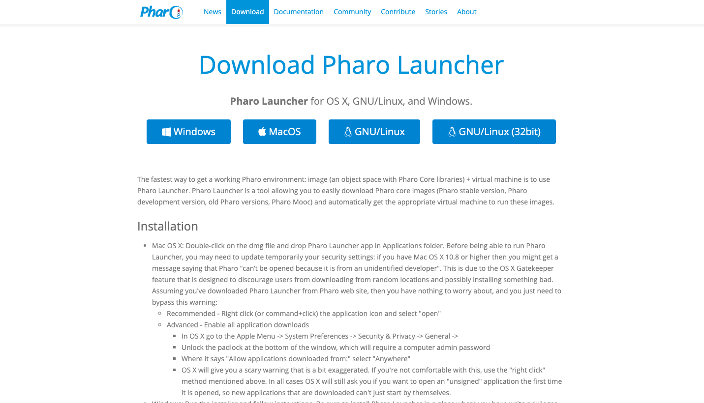

# Setting up a new project

In this article, we describe the good workflow for setting up a new project in Pharo. We will guide you through the whole process from getting a new Pharo image, creating the GitHub repository, and setting up the CI.

We will demonstrate everything by setting up a toy project - `Counter`, inspired by Chapter 14. Seaside by Example of [Pharo by Example](https://files.pharo.org/books-pdfs/updated-pharo-by-example/2017-01-14-UpdatedPharoByExample.pdf) book. It is a simple class that has a value which can be incremented or decremented.

## Step 0. Download and install Pharo Launcher

In order to work with Pharo, you should dowload and install Pharo Launcher - a tool for managing Pharo images. It is available for Windows, Linux, and macOS in both 32bit and 64bit version and can be dowloaded from [http://pharo.org/download]().

## Step 1. Get a fresh Pharo image

Instructions in this tutorial were written for Pharo 8, 64bit. But they should also work fine for Pharo 7. We suggest that you start your new project with the latest development version of Pharo.

Open your Pharo Launcher. You will see two panels:

- **New Image Templetes** on the left - here you can select a template of a new image that you want to create on your machine.
- **Current Images** on the right - created images will appear here. By double-clicking on image name, you can launch it.

Open the list of `Official distributions` in the left panel and double-click on the latest development version of Pharo. In our case, this is `Pharo 8.0 - 64bit (development version, latest)`. Give a nice descriptive name to your new image and press `OK`. You can now find your image in the right panel. Launch it by double-clicking on the image name.

## Step 2. Create a package and a class

Let us make our first package. In your newly made image in Pharo Launcher, look at the menu on the top. Choose a tools card and from there open System Browser.

System Browser is split into five parts. The most left one, shows all the packages that already exist. To create a new one, press the right click of a mouse on this part, and choose the option New Package. 

Choosing it, a new small window will open, where you give a name to the package you are creating.

We will show this by following an example. The task is to make a small library of mathematical functions.Type the name *TinyMathLibrary* in Window for creating a new package and press ok.

To create a class, first you need to choose the package in which it will be located. Then look at the bottom part of the System Browser in it there is a template for creating a class. It gives us all the information we need: superclass, variables, package. Creating a new class is as easy as filling out this template. Continuing with our example, we will create a new class *MathFunctions*. The superclass is *Object*, so we will not change that. But we will change the name of the class. You will notice that saving our class, the second left part of SystemBrowser is no longer empty.

## Step 3. Write some failing tests

## Step 4. Add methods to make tests green

## Step 5. Create repository on GitHub

## Step 6. Load the repository into your image

## Step 7. Add your package and do the first commit

## Step 8. Create a baseline and a Metacello script

## Step 9. Set up the continuous integration (CI)

## Step 10. Add badges to your README.md
